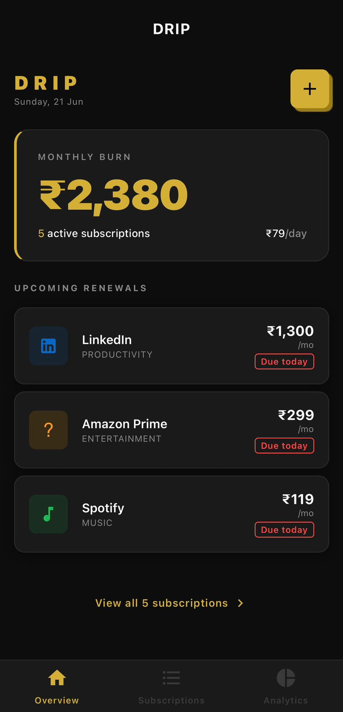
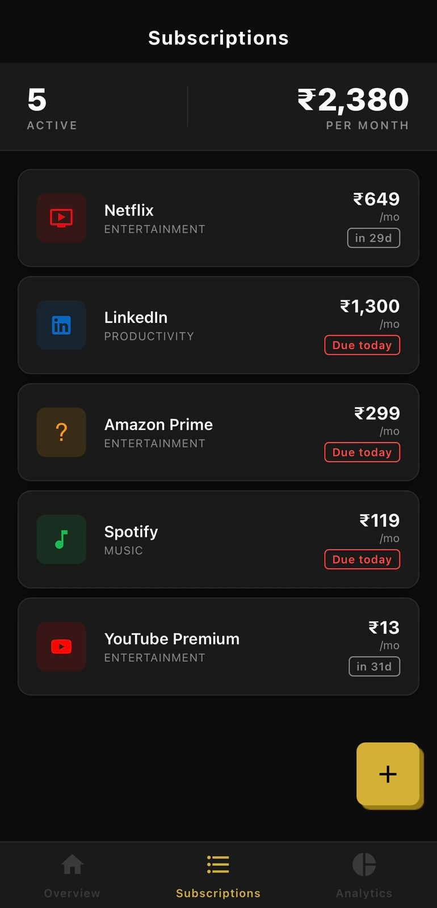
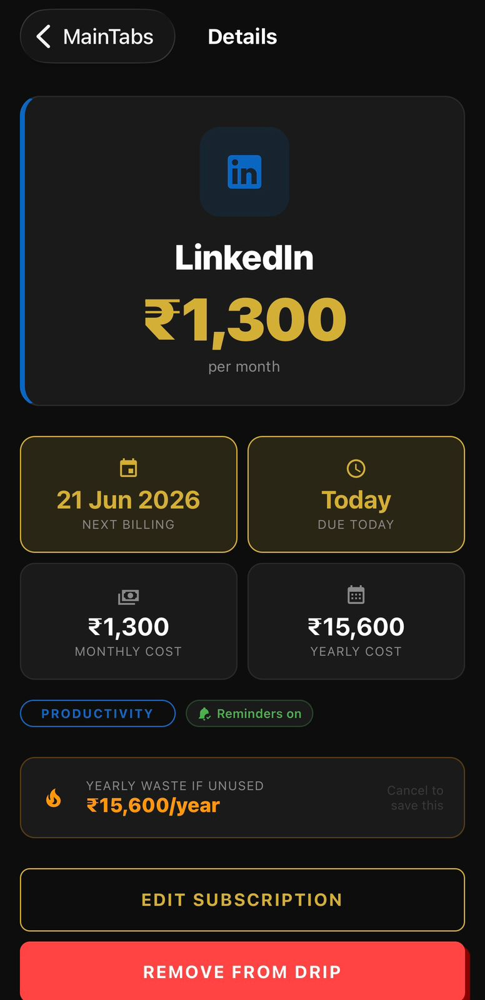
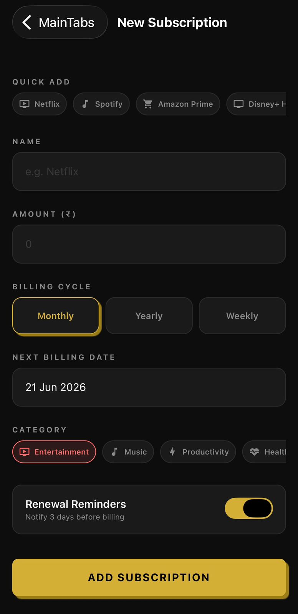
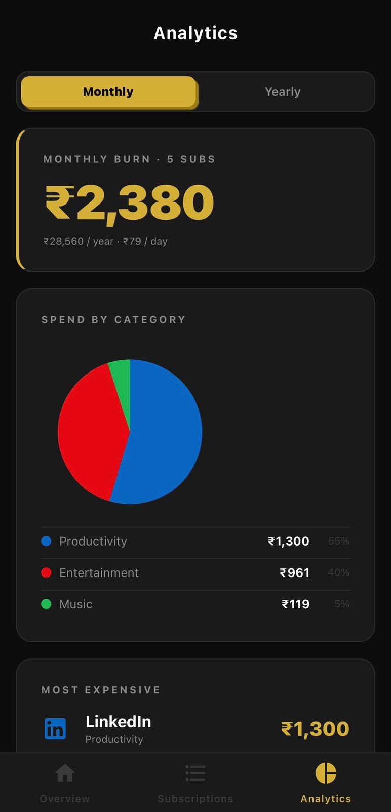
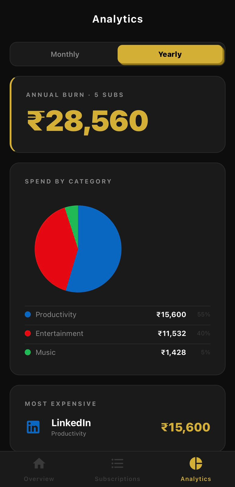

# Drip

A subscription tracker that shows exactly how much you spend on recurring charges every month. Built with React Native and Expo — no backend, no account, everything stays on your device.


---

## Screenshots

<p>
  
  &nbsp;&nbsp;&nbsp;
  
  &nbsp;&nbsp;&nbsp;
  
</p>

<p>
  
  &nbsp;&nbsp;&nbsp;
  
  &nbsp;&nbsp;&nbsp;
  
</p>

---

## Features

### Subscription Management
- Add any subscription with name, amount, billing cycle, and next billing date
- Quick-add presets for Netflix, Spotify, Amazon Prime, ChatGPT Plus, and 14 others
- Edit or remove subscriptions at any time
- Categorize by type: Entertainment, Music, Productivity, Health, and more

### Smart Dashboard
- Monthly burn rate displayed front and center
- Upcoming renewals list — see what's due in the next 7 days
- Daily cost breakdown so you can feel the real drain
- Color-coded urgency badges: renewals within 3 days highlighted

### Renewal Notifications
- Local push notifications scheduled 3 days before each billing date
- No server required — scheduled entirely on-device via expo-notifications
- Per-subscription toggle to enable or disable reminders individually

### Analytics
- Monthly and yearly view toggle
- Pie chart breakdown by category
- Most expensive subscription card
- Yearly projection with per-day and per-week cost

### Cancel Helper
- Each subscription detail page shows estimated yearly cost
- Prompts you to think before keeping an unused subscription
- Total paid so far calculated from the date you started tracking

### Design
- CRED NeoPOP aesthetic — dark background, gold accent, hard offset shadows
- Purposeful typography: one large number per screen, everything else subordinate
- Works entirely offline

---

## Tech Stack

| Layer | Choice |
|---|---|
| Framework | React Native 0.81 + Expo SDK 54 |
| Language | TypeScript 5.3 |
| Storage | AsyncStorage (local, no backend) |
| Navigation | React Navigation 6 (native-stack + bottom-tabs) |
| Notifications | expo-notifications (local, scheduled on-device) |
| Charts | react-native-chart-kit + react-native-svg |
| Date logic | date-fns v3 |
| Icons | @expo/vector-icons (MaterialCommunityIcons) |
| Architecture | New Architecture enabled (required by Reanimated v4) |

---

## Quick Start

### Prerequisites

- Node.js 20+
- Expo Go app on your phone (iOS or Android)

### Installation

Clone the repository:

```bash
git clone https://github.com/yourusername/drip.git
cd drip
```

Install dependencies:

```bash
npm install
```

Start the development server:

```bash
npx expo start --clear
```

Scan the QR code with Expo Go on your phone.

---

## Project Structure

```
src/
  types/          Subscription type definitions and navigation param lists
  constants/      Theme (colors, spacing, shadows), categories, and presets
  storage/        AsyncStorage CRUD wrappers
  utils/          Date calculations and currency formatting
  notifications/  Permission request and notification scheduling
  components/     NeoPOPButton, SubscriptionCard, StatCard, EmptyState
  screens/        Dashboard, Subscriptions, AddEdit, Detail, Analytics
  navigation/     Bottom tab + native stack navigator setup
App.tsx           Entry point — requests notification permission on start
```

---

## Data Model

Each subscription is stored as a plain JSON object in AsyncStorage:

```typescript
{
  id: string
  name: string          // "Netflix"
  amount: number        // 649
  currency: string      // "INR"
  cycle: "monthly" | "yearly" | "weekly"
  billingDate: string   // ISO 8601
  category: string      // "Entertainment"
  color: string         // hex
  iconName: string      // MaterialCommunityIcons name
  notifEnabled: boolean
  createdAt: string     // ISO 8601
}
```

---

## Usage

### Adding a Subscription

1. Tap the + button on the Dashboard or Subscriptions screen
2. Select a preset or type a custom name
3. Enter the amount and pick a billing cycle
4. Set the next billing date
5. Choose a category and toggle notifications on or off
6. Tap Add Subscription

### Reading the Dashboard

The large number at the top is your total monthly burn across all active subscriptions. The Upcoming Renewals section shows anything due in the next 7 days, sorted by urgency.

### Analytics Screen

Switch between monthly and yearly view using the toggle at the top. The pie chart breaks spend down by category. Scroll down for the yearly projection and the most expensive subscription card.

### Notifications

On first launch the app requests notification permission. If granted, a reminder is scheduled 3 days before each subscription's next billing date. Notifications are rescheduled automatically when you add or edit a subscription.

---

## Design Reference

The visual style is based on CRED's NeoPOP design system:

- Background: `#0D0D0D`
- Cards: `#1A1A1A` with a `1px #2A2A2A` border
- Accent: `#D4AF37` (gold)
- Shadows: hard offset with `shadowRadius: 0` — no blur
- Typography: one dominant number per screen, secondary text small and muted

---

